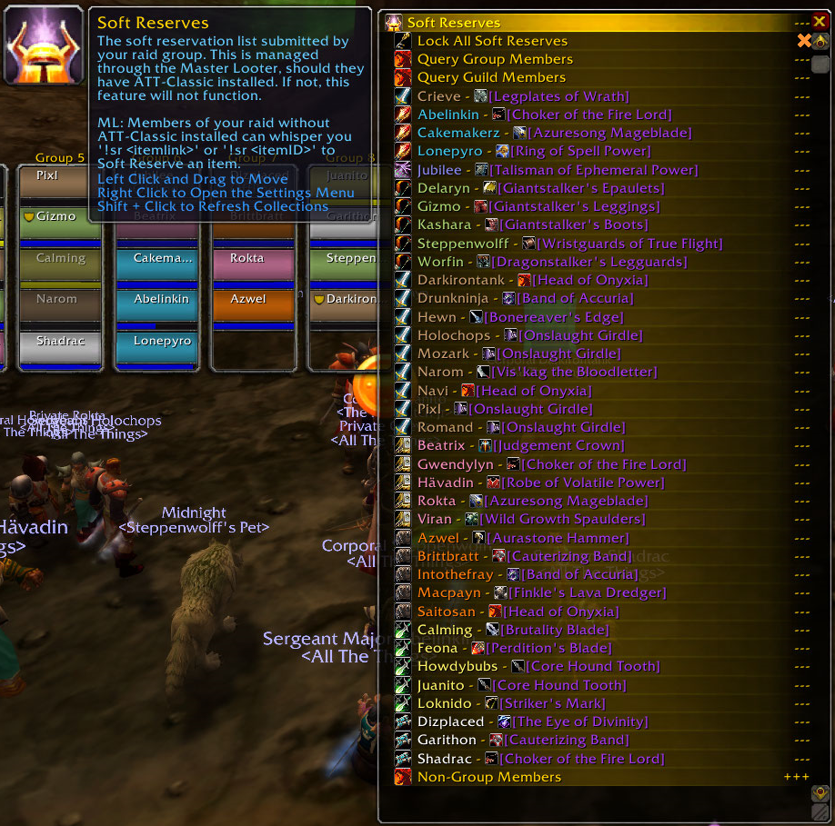
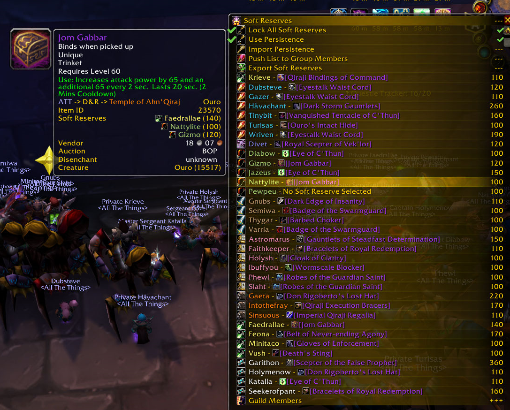

 

 

 

## Screenshots

## Features
- Manage Soft Reserves via whisper or by having your raid & guild members use the addon themselves.
- Soft Reserve data is sent to/from players in your group so that everyone sees the same thing. (Addon required)

## Why do I need this addon?
- This addon adds the Soft Reserves window to ATT. The window can help your raid manage Soft Reserves as well as Soft Reserve Persistence. The soft reserves are shown on the tooltip of items along with any persistence the player has on that item. The extension itself is fairly light weight and does not force you to loot anything in any particular way.

You can open the window using /attsr and either leave it open to have it restore or close it to open again at a later date! As with all other ATT Windows, it will recover back to its last known state on reload or relog!

## Release Schedule
New builds will generally only include updated TOC versions and bug fixes when Blizzard breaks something.

## Where do I find AllTheThings?
- [AllTheThings](https://github.com/ATTWoWAddon/AllTheThings)
Do you find yourself completing old content just so that you can get literally everything for your Collections? Say no more! ALL THE THINGS will help you with your endeavor by giving you the ability to track your completion for everything.

## Problem? Suggestion?
Please visit our Discord or post an Issue on our Issue Tracker. Issues related to ATT itself should be posted to the AllTheThings Discord instead!

- [Discord](https://discord.gg/allthethings)
- [Issues](https://github.com/ATTWoWAddon/ATT-Window-Soft-Reserves/issues)
- [FAQ](https://legacy.curseforge.com/wow/addons/all-the-things/pages/f-a-q)
- [WAGO.io](https://addons.wago.io/addons/att-window-soft-reserves)

## Contributors
Thank you to the contributors for the work they do and the users who have submitted suggestions and bugs in Discord or on the forums! View and follow [our contributors here](https://github.com/ATTWoWAddon/ATT-Window-Soft-Reserves/graphs/contributors)!

## Special Thanks
- DeadSerious -- Primary Artist for all Branding for ATT & Crieve's Twitch channel.

## Support Us
You can donate to our [Patreon here](https://www.patreon.com/allthethings)!
